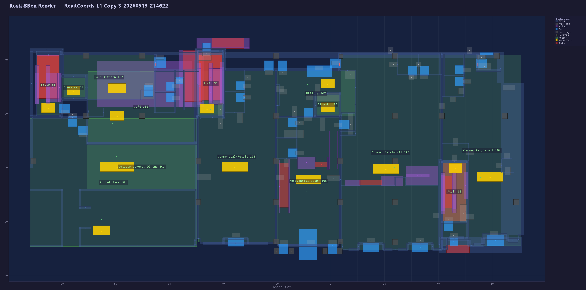

# Hello Tag: Automated Tagging Tool for Revit 2026

A Revit 2026 addin that automates annotation tag placement for rooms, doors, windows, walls, and stairs in floor plan views leveraging an LLM contextualised as a data-editing problem. Free to download and use for personal usage. 

For any enquiries please contact me: leo.lu.22@ucl.ac.uk

Developed for a university project, results and source code can be seen in the following places:

**LLM-DEP Results:**
- Results are filtered by floorplan `RAC(Project Name)`, each contain a [folder](RACSampleSnowdenTower2026/L2) with a rendered image and csv data of both the optimal 'control' floorplan and the solver's result.
- Visualisations comparing the solver's movement (cosine angle) can be seen in [Movement Vectors](Movement%20Vectors/MovementVectors_Advanced_L1.png).
- Raw output visuals can be seen in [RawExport/ExportRender](RawExport/ExportRender)
- Raw output data can be seen in [RawExport/ExportCoords](RawExport/ExportCoords)

**Other Results:**
- [ALL RESULTS w/ Graphs and Metrics](all_results.xlsx)
- [LLM-VBP](https://github.com/Asphult/LLMSolver/tree/raster-methods/LLM_VBP_Results)
- [LLM-VSP](https://github.com/Asphult/LLMSolver/tree/raster-methods/LLM_VSP_Results)
- [SA Results](https://github.com/Asphult/LLMSolver/tree/raster-methods/SA_Results)
- [Bitmap Results](https://github.com/Asphult/LLMSolver/tree/raster-methods/bitmap_results)

**Source Code:**
- [LLM_VBP_Placer.cs](https://github.com/Asphult/LLMSolver/blob/raster-methods/LLM_VBP_Placer.cs)
- [LLM_VSP_Placer.cs](https://github.com/Asphult/LLMSolver/blob/raster-methods/LLM_VSP_Placer.cs)
- [SimulatedAnnealingPlacer.cs](https://github.com/Asphult/LLMSolver/blob/raster-methods/SimulatedAnnealingPlacer.cs)
- [BitmapPlacer.cs](https://github.com/Asphult/LLMSolver/blob/raster-methods/BitmapPlacer.cs)

## Requirements

- Autodesk Revit 2026
- Windows 10 or 11

## Installation

1. Copy both files into `%AppData%\Autodesk\Revit\Addins\2026\`:
   - `RevitHelloTag.dll`
   - `RevitHelloTag.addin`
2. Restart Revit.
3. A **Hello Tag** ribbon tab will appear.

If Revit shows a security warning the first time, click **Always Load**.

## Features

All commands operate on the **active floor plan view** only. Commands that place tags require the relevant tag family to be loaded in the project (e.g. Room Tag.rfa, Door Tag.rfa).

Currently tags can only be applied to walls, doors, windows, rooms.

### Tagging Commands

| Button | Description |
|--------|-------------|
| Tag Next | Tags the next untagged element (sorted by element ID). |
| Tag All | Tags every untagged element type in one step. All placements are a single undo step. |

### Tagging Walls

| Button | Description |
|--------|-------------|
| Tag Walls by Length | Prompts for a minimum wall length in metres, then tags only walls that meet or exceed that threshold. |

### Export Coords

| Category | Elements |
|----------|----------|
| Spatial & Organization | Rooms, Room Tags, Grids, Shaft Openings |
| Envelope & Structure | Walls, Columns, Structural Columns, Curtain Panels, Curtain Wall Mullions, Curtain Wall Grids, Wall Sweeps |
| Access & Movement | Doors, Windows, Stairs, Multistory Stairs, Runs, Landings, Railings, Top Rails, Handrails, Supports |
| Interior & Furnishings | Furniture, Furniture Systems, Casework, Plumbing Fixtures, Specialty Equipment |
| Mechanical & Electrical | Mechanical Equipment, Electrical Equipment |

[View Example Data](RACSampleSnowdenTower2026/L1/Output.csv)

Exports a CSV of all visible elements in the active view to the Desktop. A selection dialog lets you choose which element categories to include, with a **Quick Select Tags** button that pre-selects the standard taggable categories (Walls, Doors, Windows, Stairs, Rooms, Columns, Railings).

Output file: `RevitCoords_<ViewName>_<timestamp>.csv` on the Desktop.

The CSV includes model coordinates, view-local coordinates, bounding boxes, and a separate section for all existing tags in the view.

### Render CSV



Opens a file picker for a CSV produced by Export Coords and renders a colour-coded PNG and SVG floor plan diagram to the Desktop, showing bounding boxes for every element category, tag positions, room labels, and rotation arrows.

Output files: `BBoxRender_<name>_<timestamp>.png` and `.svg` on the Desktop.

### LLM Solve

Uses the Claude API to automatically reposition all tags in the active view. Currently still WIP, results may vary. 

The solver:

1. Collects all elements and tags from the view
2. Sends them to Claude as a CSV with placement rules
3. Applies Claude's suggested positions inside a single Revit transaction (one undo step)
4. Saves input/output CSVs to `Desktop\REVIT_LLM\` for inspection

**This feature requires an Anthropic API key.** Set the `ANTHROPIC_API_KEY` environment variable before launching Revit:

```powershell
# Run once in PowerShell (persists across reboots):
[Environment]::SetEnvironmentVariable("ANTHROPIC_API_KEY", "sk-ant-...", "User")
```

Then restart Revit completely. If the key is not set, the button will show a diagnostic message explaining how to fix it.

**One-shot examples (optional):** Place `example_input.csv` and `example_output.csv` in `Desktop\REVIT_LLM\examples\` to give the solver a reference example from your own project. This improves output quality.

## Output file locations

All output files go to the current user's Desktop.

| Feature | Output location |
|---------|----------------|
| Export Coords | Desktop |
| Render CSV | Desktop |
| LLM Solve (CSVs) | Desktop\REVIT_LLM\ |

## Known Issues

- Occasionally the plugin will erroneously output the error 'The active view must be a floor plan view'. To mitigate this, simply close and re-open the floor plan view.

- For certain screen resolutions, the pop-up window for the Render CSV command will have the quick selection boxes cut-off. Please select manually or change resolution.


## Troubleshooting

**The ribbon tab doesn't appear**
- Confirm both `RevitHelloTag.dll` and `RevitHelloTag.addin` are in `%AppData%\Autodesk\Revit\Addins\2026\`.
- Restart Revit after copying the files.

**A button does nothing or shows an error**
- The active view must be a floor plan view. The commands will not run from 3D views, sections, or elevations.
- If a tag family is not loaded (e.g. no Door Tag family in the project), the command will report it and cancel.

**LLM Solve — API key not found**
- The `ANTHROPIC_API_KEY` environment variable must be set as a **User** variable (not just in a terminal), and Revit must be restarted after setting it.
- See the PowerShell command above.

**LLM Solve is slow**
- This is expected. The solver sends the full view data to Claude and may take up to few minutes on large views.
